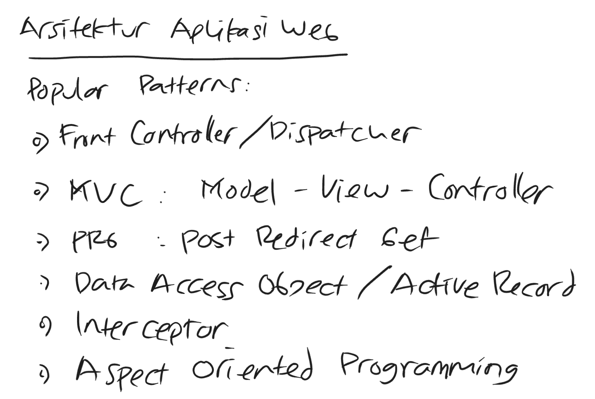

# 01 — Web app architecture patterns



Six patterns that show up in every server-rendered web stack. The names look fancy; the ideas are simple. This page maps each pattern to where it lives in our three implementations so students can read the code and recognize the pattern by sight.

## 1. Front Controller / Dispatcher

A single entry point that receives every HTTP request and dispatches to the right handler based on method + path.

| Stack | Front Controller |
|-------|------------------|
| Spring Boot | `DispatcherServlet` (auto-wired by `spring-boot-starter-webmvc`) |
| Express | the Express `app` object itself; `app.use(router)` mounts the dispatcher |
| Go | `http.ServeMux` (since Go 1.22 it does method-aware dispatch — `mux.HandleFunc("POST /register", ...)`) |

Without this pattern you would write a giant `switch (path)` block per file. The Front Controller centralizes routing, middleware ordering, and 404 handling.

## 2. MVC — Model · View · Controller

- **Model** — plain data + business logic. Two flavors in this app:
  - *Form model* (input): `RegistrationForm` — receives HTTP form fields, carries validation rules.
  - *Domain model* (storage): `Registration` — the thing that lives in the DB.
- **View** — pure rendering, no logic. Thymeleaf, Handlebars, `html/template`.
- **Controller** — glues request → model → view. Returns a view name; the framework finds and renders it.

| Stack | Form Model | Domain Model | View | Controller |
|-------|-----------|--------------|------|------------|
| Spring Boot | `web/RegistrationForm.java` (record) | `domain/Registration.java` (record) | `templates/*.html` | `web/RegistrationController.java` |
| Express | `src/validation.js` (Zod schema) | row object from `pg` | `src/views/*.hbs` | `src/routes/registration.js` |
| Go | `internal/web/form.go` (`RegistrationForm` struct) | `internal/domain/registration.go` (`Registration` struct) | `internal/web/templates/*.html` | `internal/web/handler.go` |

Note that the form model and domain model are **deliberately separate**. The form model carries input-side concerns (validation tags, raw user-typed strings). The domain model carries storage-side concerns (UUID id, server-generated timestamp). Don't merge them.

## 3. PRG — Post · Redirect · Get

After a successful POST that changes state, the server responds with HTTP **302** and a `Location:` header pointing at a GET URL. The browser follows the redirect; the URL bar shows the GET, not the POST. Hitting refresh re-runs the GET, not the POST.

Without PRG, refresh after a registration submits the form a second time. The duplicate-email check catches that, but the user experience is bad.

All three stacks implement PRG: `POST /register` → `302` → `GET /registrations`. Verify with `scripts/verify-http.sh` — the script asserts status 302 for valid registrations.

## 4. Data Access Object (DAO) / Active Record

Two ways to organize DB access. We use DAO across all three stacks; Active Record is shown for contrast.

**DAO** — domain object is dumb data; a *separate* repository object owns SQL.

```
Registration (struct/record/class)  ← pure data
RegistrationRepository              ← Insert(), FindAll(), etc.
```

**Active Record** — domain object owns its own SQL. `user.save()`, `user.find()`.

Frameworks that lean Active Record: Ruby on Rails, Laravel Eloquent, Django ORM, GORM (Go). DAO is more common in Java (JdbcTemplate, JPA repositories), Node (`pg`, `knex`), and idiomatic Go (`database/sql` with handwritten repos).

In this repo:
- Spring Boot — `repository/RegistrationRepository.java` uses `JdbcTemplate`. Pure DAO.
- Express — `src/routes/registration.js` calls `pool.query(...)` directly (in this small app the "repository" is inlined into the route handler — a step lighter than DAO).
- Go — `internal/repository/registration.go` is a struct with methods. Pure DAO.

## 5. Interceptor / Middleware

A function that wraps every (or every-matched) request. Used for cross-cutting concerns:

- request logging
- authentication
- response timing
- CSRF
- response headers (CORS, security)

| Stack | Interceptor mechanism | Example in this repo |
|-------|----------------------|----------------------|
| Spring Boot | `HandlerInterceptor` or servlet `Filter` | (not implemented yet) |
| Express | `app.use(middleware)` — `function(req, res, next) {...}` | `requestLogger` in `src/app.js` |
| Go | wrapper functions: `func(http.Handler) http.Handler` | `RequestLogger` in `internal/web/middleware.go` |

Pattern across all three: middleware composes by chaining. Each layer can short-circuit (write a response + don't call next), or pass through, or modify the request/response on the way through.

## 6. AOP — Aspect Oriented Programming

Like middleware, but at the **method-call** level, not the HTTP-request level. You annotate methods (or write pointcut expressions) and the framework wraps them with cross-cutting behavior at runtime.

Classic AOP use cases:
- transactions (`@Transactional`)
- security (`@PreAuthorize`)
- caching (`@Cacheable`)
- audit logging (custom aspect that runs around any service method)

Spring's AOP is the canonical example. The annotation expands to a runtime proxy that wraps the real bean.

Express and Go do not have built-in AOP. The equivalent in those stacks is *higher-order functions* — wrap a handler/repo method in a function that adds the behavior. Less declarative, but mechanically identical.

## What students should notice

The same six patterns appear in all three stacks. The *names* differ (`@Aspect` vs `app.use` vs higher-order function), but the underlying responsibility — "intercept and transform a request as it flows through the system" — is the same. Recognizing this means you can switch frameworks without re-learning architecture.
