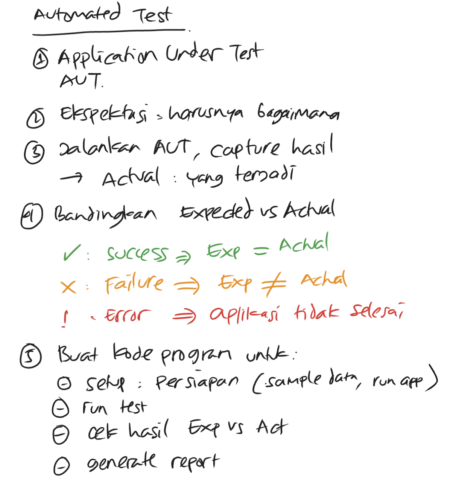
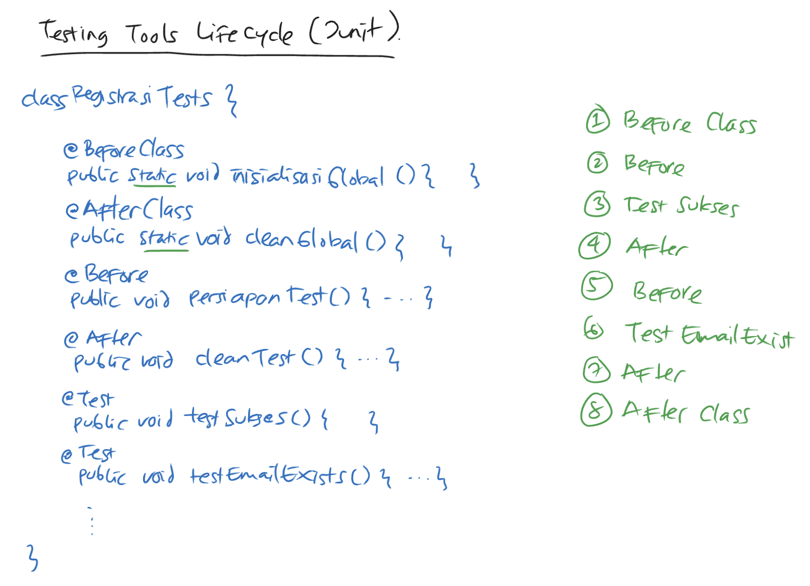
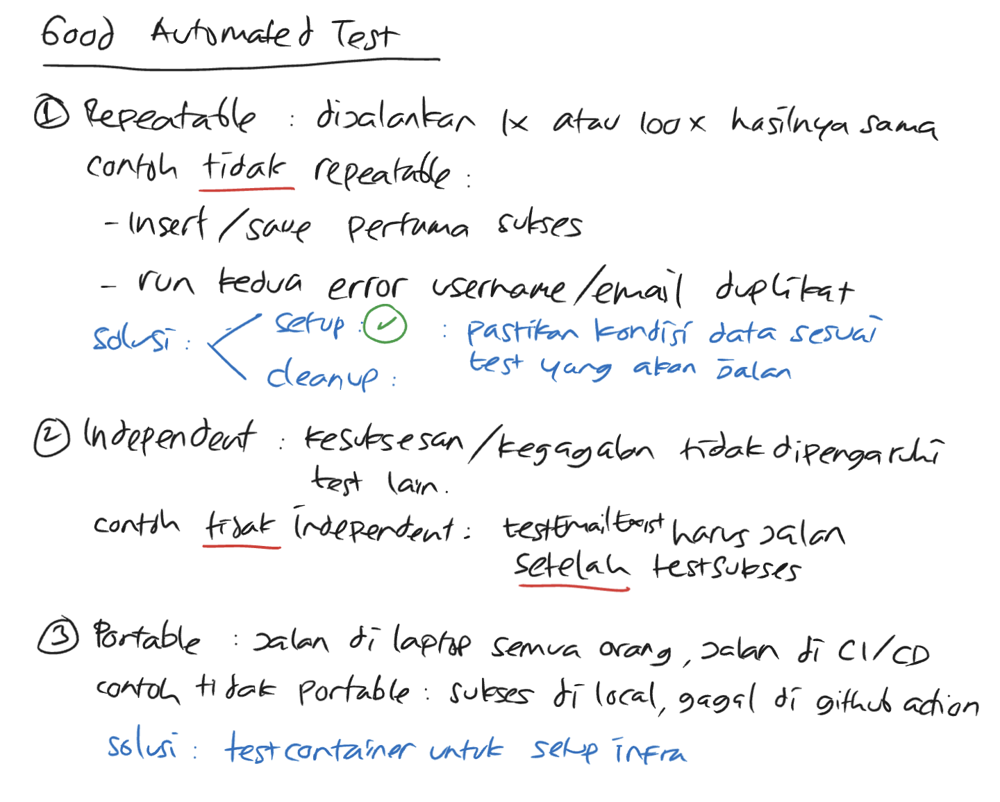

# 02 — Automated test fundamentals

Three things every automated test rests on: a **mental model** of what a test is doing, a **lifecycle** that orders setup / test / cleanup, and three **quality criteria** every test must satisfy.

## 1. Mental model — what is an automated test?



A test is just five steps in a fixed order:

| Step | Indonesian (notes) | English |
|------|--------------------|---------|
| 1 | Application Under Test (AUT) | The system you are testing |
| 2 | Ekspektasi | Expected — declare what *should* happen before running |
| 3 | Jalankan AUT, capture hasil → Actual | Run the AUT and record what *did* happen |
| 4 | Bandingkan Expected vs Actual | Compare expected vs actual |
| 5 | Buat kode program untuk: setup, run, assert, report | Wire it as code: setup → run → assert → report |

Three outcomes from step 4:

| Outcome | Indonesian | Condition |
|---------|------------|-----------|
| ✓ **Success** | sukses | Expected = Actual |
| ✗ **Failure** | gagal | Expected ≠ Actual (AUT ran, but produced the wrong result) |
| ! **Error** | error | The AUT couldn't finish (`aplikasi tidak selesai`) — exception, timeout, missing fixture |

The Failure-vs-Error distinction matters: failure means *my code is wrong*; error means *my test setup is wrong*. Different debugging strategies.

## 2. Lifecycle — how tests run



JUnit naming (the same pattern shows up in TestNG, Jest, Pytest, Go `testing.M`):

| Annotation | Runs | Purpose |
|------------|------|---------|
| `@BeforeClass` (JUnit 4) / `@BeforeAll` (JUnit 5) | once before any test in the class | expensive one-time setup (start a container, load a model) |
| `@Before` (JUnit 4) / `@BeforeEach` (JUnit 5) | before *every* test method | per-test setup (reset DB, build a fresh form) |
| `@Test` | the test itself | one assertion (or one assertion-group) per method |
| `@After` / `@AfterEach` | after every test method | per-test cleanup (delete rows, close transaction) |
| `@AfterClass` / `@AfterAll` | once after the last test | one-time teardown (stop container) |

Execution order for a class with two `@Test` methods (`testSukses`, `testEmailExists`):

```
1  @BeforeClass     inisialisasiGlobal()
2  @Before          persiapanTest()
3  @Test            testSukses()
4  @After           cleanTest()
5  @Before          persiapanTest()
6  @Test            testEmailExists()
7  @After           cleanTest()
8  @AfterClass      cleanGlobal()
```

**Key invariant:** `@Before` runs between every test, even if a test failed. `@After` runs even if the test threw. That's how independence (next section) is enforced.

### Equivalents across frameworks

| Java / JUnit 5 | Node / Jest | Node / Vitest | Go / `testing` | Python / pytest |
|---|---|---|---|---|
| `@BeforeAll` | `beforeAll` | `beforeAll` | `TestMain` / package-level setup | fixture with `scope="session"` |
| `@BeforeEach` | `beforeEach` | `beforeEach` | helper called at top of each `Test*` | fixture with `scope="function"` |
| `@Test` | `test`/`it` | `test`/`it` | `func TestXxx(t *testing.T)` | function starting with `test_` |
| `@AfterEach` | `afterEach` | `afterEach` | `t.Cleanup(...)` | fixture teardown |
| `@AfterAll` | `afterAll` | `afterAll` | package-level teardown | fixture teardown |

The vocabulary changes; the lifecycle does not.

## 3. The three criteria — what makes a test "good"



A test that doesn't satisfy all three is worse than no test — it gives false confidence.

### Repeatable

Running the same test 1× and 100× gives the same result.

**Bad example** (from the notes):

> Insert/save pertama sukses. Run kedua error: username/email duplikat.

First run: inserts `alice@example.com` — passes.
Second run: tries to insert the same email — UNIQUE constraint blows up. Test fails on the *second* run despite no code change.

**Fix** — every test must run inside a setup/cleanup envelope that puts the DB into a known state regardless of previous runs:

| Approach | Pros | Cons |
|----------|------|------|
| Setup: insert known fixture, then test | predictable | needs cleanup |
| Cleanup: rollback transaction at the end | fast, no residue | only works inside a single connection |
| Fresh container per test class | most isolation | slow if naive |

Spring Boot's `@Transactional` on test methods rolls back automatically. Testcontainers + a fresh container per class is the cross-stack baseline (see [05-test-infrastructure.md](05-test-infrastructure.md)).

### Independent

Success/failure of test A must not depend on test B running first (or at all).

**Bad example** (from the notes):

> `testEmailExists` harus jalan setelah `testSukses`.

This means `testSukses` inserts the row that `testEmailExists` then asserts as a duplicate. Run `testEmailExists` in isolation and it fails. Reorder the tests alphabetically (some runners do this) and `testEmailExists` runs first and fails.

**Fix** — `testEmailExists` inserts its own fixture inside `@BeforeEach`. The test makes no assumption about previous tests having run.

Independence also enables **parallel execution**. JUnit 5 parallel mode, Vitest parallel, Go `t.Parallel()` — all only work when tests are independent.

### Portable

The test passes on every developer's laptop AND in CI.

**Bad example** (from the notes):

> Sukses di local, gagal di GitHub Actions.

Common causes:
- relies on a Postgres listening on `localhost:5432` (works locally, not in CI)
- relies on `Asia/Jakarta` timezone (CI is UTC)
- relies on a file at an absolute path (`/Users/...`)
- relies on a specific port being free

**Fix** — Testcontainers. A test that starts its own Postgres container per class runs the same way on a laptop and on a CI runner, because the test owns its infrastructure. See [05-test-infrastructure.md](05-test-infrastructure.md).

## Summary

| Concept | One-line definition |
|---------|---------------------|
| Mental model | Setup → run → compare expected vs actual → report |
| Lifecycle | `@BeforeAll / @BeforeEach / @Test / @AfterEach / @AfterAll` ordering, enforced by the runner |
| Repeatable | 1× ≡ 100× |
| Independent | Order-free |
| Portable | Laptop ≡ CI |

If a test fails one of the three criteria, fix the test before fixing the code under test.
