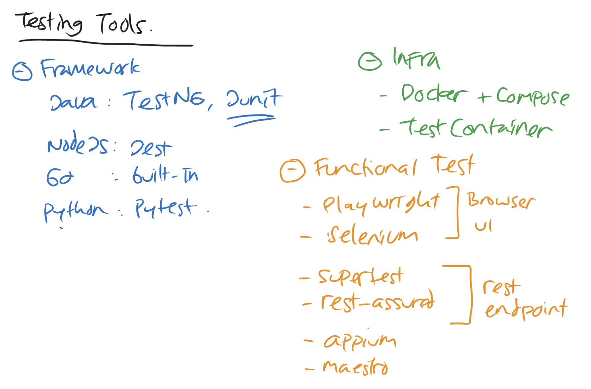

# 03 — Testing tools landscape

Three layers of tooling. Pick one tool per layer per stack — the choices don't compose freely.

## Framework — the test runner

The thing that finds your tests, runs them, and reports pass/fail/skipped.

| Language | Idiomatic runner | Alternatives |
|----------|------------------|--------------|
| Java | **JUnit 5** (Jupiter) — *the* standard, what's used by Spring Boot Test | TestNG (older, parameterized via XML) |
| Node.js | **Vitest** (fast, TypeScript-aware) or **`node:test`** (built-in, no dep) | Jest (older, slow start), Mocha (manual assertions) |
| Go | **`testing`** (stdlib, no dep) | testify (assertion library on top) |
| Python | **pytest** | unittest (stdlib, more verbose) |

For this project (recommended picks):
- Spring Boot → **JUnit 5** (already on the classpath via `spring-boot-starter-test`)
- Express → **`node:test`** (built into Node 22+, zero dep)
- Go → **`testing`** (stdlib)

Why prefer the stdlib runner where available: fewer deps, no version drift, students see the language's own conventions.

## Infrastructure — what tests run against

For anything that needs a real database, message broker, or external service, you need *real instances* in tests (mocks lie). Two ways to provide them:

| Tool | Use when |
|------|----------|
| **Docker Compose** | dev workflow, manual exploration |
| **Testcontainers** | automated tests — each test class spins up its own ephemeral container, cleans up when done |

Testcontainers is the right choice for tests because:
- The test owns the container's lifecycle — no "did you start Postgres?" preamble.
- Each test class can have an isolated container, killing cross-test contamination.
- Same code path works on laptops and in CI runners (which have Docker available by default in GitHub Actions, GitLab CI, etc.).

Testcontainers is multi-language: `testcontainers-java`, `testcontainers-node`, `testcontainers-go`. Same concept, language-native API.

See [05-test-infrastructure.md](05-test-infrastructure.md) for the actual setup.

## Functional / E2E test tools

Tests that exercise the application from the *outside* — browser, HTTP client, or mobile UI.

### Browser UI

| Tool | Strengths | Note |
|------|-----------|------|
| **Playwright** | fast, multi-browser, parallel by default, great debugging tools (trace viewer, codegen) | first choice in 2026 |
| Selenium | older, larger ecosystem | retiring in most new projects |
| Cypress | great DX, but single-browser per session, harder to parallelize | not recommended for this project |

For our project: one Playwright project at repo root drives the form-submission flow against whichever stack is running on `localhost:8080`. Stack-agnostic.

### REST endpoint

| Tool | Language | Note |
|------|----------|------|
| **rest-assured** | Java | fluent API: `given().when().then()` |
| **supertest** | Node | wraps Express app or hits a URL |
| **httptest** (`net/http/httptest`) | Go (stdlib) | spin up the handler in-process |

For our project:
- Spring Boot → rest-assured
- Express → supertest
- Go → httptest

### Mobile

| Tool | Note |
|------|------|
| Appium | mobile equivalent of Selenium — out of scope for this project |
| Maestro | newer, declarative YAML-based mobile flows — out of scope |

Not used here. Listed for completeness — the registration app has no mobile client.

## Performance / capacity planning

| Tool | Approach |
|------|----------|
| **k6** | JavaScript-scripted load test, modern default. Outputs latency p50/p95/p99, RPS, error rate. |
| wrk / hey | simple CLI tools, single-URL stress |
| JMeter | UI-driven, heavy, older |
| Gatling | Scala DSL, sophisticated, steeper curve |

For our project: **k6** drives `POST /register` and `GET /registrations` to measure each stack's RPS ceiling and p95 latency. See [04-test-types.md](04-test-types.md).

## Per-stack pick (summary)

What this project will use when test infra is implemented:

| Layer | Spring Boot | Express | Go |
|-------|-------------|---------|----|
| Test runner | JUnit 5 | `node:test` | `testing` |
| Assertion lib | AssertJ | `node:assert` | `testing` + table-driven |
| HTTP-level tests | rest-assured + `@SpringBootTest(WebEnvironment.RANDOM_PORT)` | supertest | `net/http/httptest` |
| DB infra in tests | Testcontainers Java | Testcontainers Node | testcontainers-go |
| Browser E2E | Playwright (shared, repo-root project) | same | same |
| Load test | k6 (shared, repo-root project) | same | same |
| Coverage | JaCoCo | c8 (vitest --coverage or `node --experimental-test-coverage`) | `go test -coverprofile` |
| Coverage threshold | jacoco-maven-plugin rule | `vitest.config` threshold | custom script |
| CI | GitHub Actions | GitHub Actions | GitHub Actions |

Same concept, different vocabularies — same pattern as the runtime stacks.
