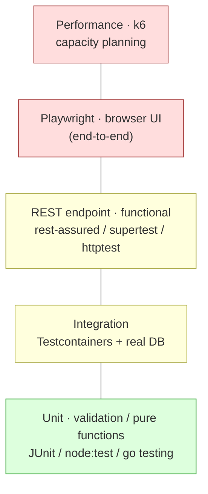

# 04 — Test types in this project

Five distinct test types, each with its own scope, speed, and tooling. None of these tests exist in the scaffold yet — this page is the *plan*, with concrete tooling picks for the three stacks. Implementing them is the practical part of the course.

The shape of the pyramid (top = slow & few, bottom = fast & many):



The lower a test is, the faster it runs and the more of them you write.

## 1. Unit tests

**Scope:** one function/class, no I/O, no DB, no HTTP.

**What to test in this project:**
- Validation logic. `RegistrationForm` field rules: required, length, regex.
- Pure helpers: `Registration.createdAtFormatted()`, the email-normalization step.

**Example (Spring Boot, JUnit 5):**

```java
@Test
void rejects_email_without_at_sign() {
    var form = new RegistrationForm("nope", "Alice", "08123456789");
    var violations = validator.validate(form);
    assertThat(violations).hasSize(1)
        .first()
        .extracting(ConstraintViolation::getPropertyPath, Object::toString)
        .containsExactly("email", "valid email is required");
}
```

**Example (Go, `testing` with table-driven):**

```go
func TestRegistrationFormValidation(t *testing.T) {
    cases := []struct {
        name      string
        form      RegistrationForm
        wantField string
    }{
        {"no-at", RegistrationForm{Email: "nope", FullName: "Alice", Phone: "08123456789"}, "email"},
        {"short-name", RegistrationForm{Email: "a@b.c", FullName: "X", Phone: "08123456789"}, "fullName"},
    }
    v := NewValidator()
    for _, tc := range cases {
        t.Run(tc.name, func(t *testing.T) {
            err := v.Struct(tc.form)
            errs := CollectErrors(err)
            if _, ok := errs[tc.wantField]; !ok {
                t.Errorf("expected error on %s, got %v", tc.wantField, errs)
            }
        })
    }
}
```

**Example (Express, `node:test`):**

```javascript
import { test } from 'node:test';
import assert from 'node:assert/strict';
import { RegistrationSchema } from '../src/validation.js';

test('rejects email without dot', () => {
    const result = RegistrationSchema.safeParse({
        email: 'a@b', fullName: 'Alice', phone: '08123456789',
    });
    assert.equal(result.success, false);
    assert.equal(result.error.issues[0].path[0], 'email');
});
```

Unit tests should run in milliseconds. Hundreds of them, total wall time under a second.

## 2. Integration tests

**Scope:** code + real database. No HTTP layer.

**What to test in this project:**
- `RegistrationRepository.insert(...)` actually inserts.
- `findAllOrderByCreatedAtDesc()` returns rows in the right order.
- Duplicate email → `ErrDuplicateEmail` / `DuplicateKeyException` / `err.code === '23505'`.
- DB CHECK constraints fire (defense in depth — covered today by `scripts/verify-db-constraints.sh`).

These tests need a real Postgres. Use Testcontainers — see [05-test-infrastructure.md](05-test-infrastructure.md). Each test class spins up its own Postgres container.

**Spring Boot example:**

```java
@SpringBootTest
@Testcontainers
class RegistrationRepositoryIT {
    @Container
    static PostgreSQLContainer<?> postgres = new PostgreSQLContainer<>("postgres:18-alpine");

    @DynamicPropertySource
    static void registerProps(DynamicPropertyRegistry r) {
        r.add("DATABASE_URL", () ->
            "postgres://" + postgres.getUsername() + ":" + postgres.getPassword()
            + "@" + postgres.getHost() + ":" + postgres.getFirstMappedPort()
            + "/" + postgres.getDatabaseName());
    }

    @Autowired RegistrationRepository repo;

    @Test
    void duplicate_email_throws() {
        repo.insert(new Registration(UUID.randomUUID(), "dup@example.com", "First", "08123456789", OffsetDateTime.now()));
        assertThatThrownBy(() ->
            repo.insert(new Registration(UUID.randomUUID(), "dup@example.com", "Second", "08123456789", OffsetDateTime.now()))
        ).isInstanceOf(DuplicateKeyException.class);
    }
}
```

The Flyway migration runs automatically when Spring Boot starts against the container. Each test method runs in its own transaction (rolled back) — or use `@Sql` for setup files.

## 3. REST endpoint / functional tests

**Scope:** real HTTP layer, real DB. Verifies routing, status codes, redirects, validation responses.

**What to test:** everything `scripts/verify-http.sh` covers, but inside each stack's native test runner. This makes the verification grep-able in coverage reports.

**Spring Boot (rest-assured + `@SpringBootTest(WebEnvironment.RANDOM_PORT)`):**

```java
@SpringBootTest(webEnvironment = SpringBootTest.WebEnvironment.RANDOM_PORT)
@Testcontainers
class RegistrationHttpIT {
    @LocalServerPort int port;
    @Container static PostgreSQLContainer<?> postgres = new PostgreSQLContainer<>("postgres:18-alpine");

    @Test
    void valid_registration_redirects() {
        given().port(port)
            .formParam("email", "alice@example.com")
            .formParam("fullName", "Alice Doe")
            .formParam("phone", "08123456789")
        .when()
            .post("/register")
        .then()
            .statusCode(302)
            .header("Location", "/registrations");
    }
}
```

**Express (supertest):**

```javascript
import { test } from 'node:test';
import request from 'supertest';
import { createApp } from '../src/app.js';

test('POST /register valid -> 302', async () => {
    const app = createApp();
    const response = await request(app)
        .post('/register')
        .type('form')
        .send({ email: 'alice@example.com', fullName: 'Alice Doe', phone: '08123456789' });
    assert.equal(response.status, 302);
    assert.equal(response.headers.location, '/registrations');
});
```

**Go (httptest):**

```go
func TestPostRegister_Valid_Redirects(t *testing.T) {
    server := httptest.NewServer(buildMux(t)) // helper that wires repo + container
    defer server.Close()
    resp, _ := http.PostForm(server.URL + "/register", url.Values{
        "email":    {"alice@example.com"},
        "fullName": {"Alice Doe"},
        "phone":    {"08123456789"},
    })
    if resp.StatusCode != http.StatusFound {
        t.Fatalf("want 302, got %d", resp.StatusCode)
    }
    if loc := resp.Header.Get("Location"); loc != "/registrations" {
        t.Errorf("want Location: /registrations, got %q", loc)
    }
}
```

These are what enforce the contract from inside each stack. The shell script (`scripts/verify-http.sh`) verifies the same thing from the outside — both are useful: the script catches "is this stack actually wired up at all," the in-process tests give per-line coverage and run faster.

## 4. Playwright UI / E2E

**Scope:** real browser, real network, real DB.

**Why also have these if we have HTTP tests?** Because the HTML / Tailwind classes / form behavior in the browser is not exercised by REST tests. Playwright drives a real Chromium/Firefox/WebKit, fills the form, clicks Register, and asserts the list page renders the new entry.

**Project structure** — one Playwright project at the repo root, configurable base URL:

```
playwright/
├── playwright.config.ts
├── tests/
│   ├── register.spec.ts       # form happy path
│   ├── validation.spec.ts     # field-level error display
│   └── duplicate.spec.ts      # duplicate email
```

```typescript
import { test, expect } from '@playwright/test';

test('register a new user and see them in the list', async ({ page }) => {
    await page.goto('/');
    await page.fill('#email', `alice-${Date.now()}@example.com`);
    await page.fill('#fullName', 'Alice Doe');
    await page.fill('#phone', '08123456789');
    await page.click('button[type=submit]');
    await expect(page).toHaveURL('/registrations');
    await expect(page.locator('table')).toContainText('Alice Doe');
});
```

Run against any stack:

```bash
PLAYWRIGHT_BASE_URL=http://localhost:8080 npx playwright test
```

Reset DB between full Playwright runs. Use timestamped emails inside tests to keep tests independent within a single run.

## 5. Performance / capacity planning (k6)

**Scope:** the production-equivalent HTTP layer under realistic concurrency.

**Goal:** answer "how many registrations per second can this stack handle on this hardware before the latency p95 crosses X ms or the error rate exceeds Y%?" — that number feeds capacity planning.

```javascript
// perf/register.k6.js
import http from 'k6/http';
import { check } from 'k6';

export const options = {
    stages: [
        { duration: '30s', target: 50 },   // ramp to 50 VUs
        { duration: '2m',  target: 50 },   // hold
        { duration: '30s', target: 0 },    // ramp down
    ],
    thresholds: {
        http_req_duration: ['p(95)<200'],
        http_req_failed:   ['rate<0.01'],
    },
};

export default function () {
    const payload = {
        email: `user-${__VU}-${__ITER}-${Date.now()}@example.com`,
        fullName: 'Load Test User',
        phone: '08123456789',
    };
    const res = http.post(`${__ENV.BASE_URL}/register`, payload);
    check(res, { '302 redirect': r => r.status === 302 });
}
```

Run:

```bash
BASE_URL=http://localhost:8080 k6 run perf/register.k6.js
```

Read the output:

- `http_req_duration p(95)=...` — the latency capacity ceiling.
- `http_reqs / iteration_duration` — throughput in req/s.
- `http_req_failed rate=...` — error rate. Anything above ~1% means the stack is saturated.

For cross-stack comparison: run the same k6 script against each stack with the same hardware, same DB, same target RPS. The relative numbers are what's interesting (Express vs Spring Boot vs Go on the same machine).

Capacity planning is **not** a CI gate — it's a periodic measurement. Don't put a p95 threshold in the CI pipeline because it varies with the CI runner; run k6 locally or on dedicated perf hardware.

## Summary

| Type | Speed | Tools | Where it runs |
|------|-------|-------|---------------|
| Unit | ms | JUnit / node:test / Go testing | per-test, every commit |
| Integration | sec | + Testcontainers (real Postgres) | per-test class, every commit |
| REST endpoint | sec | + rest-assured / supertest / httptest | every commit |
| Playwright UI | ~1 min | Playwright + running app | every PR |
| k6 perf | minutes | k6, dedicated hardware | periodic, not CI |

The first four go into the CI pipeline with an 80% line-coverage gate (see [06-cicd-coverage.md](06-cicd-coverage.md)). k6 is a separate workflow you run on demand.
