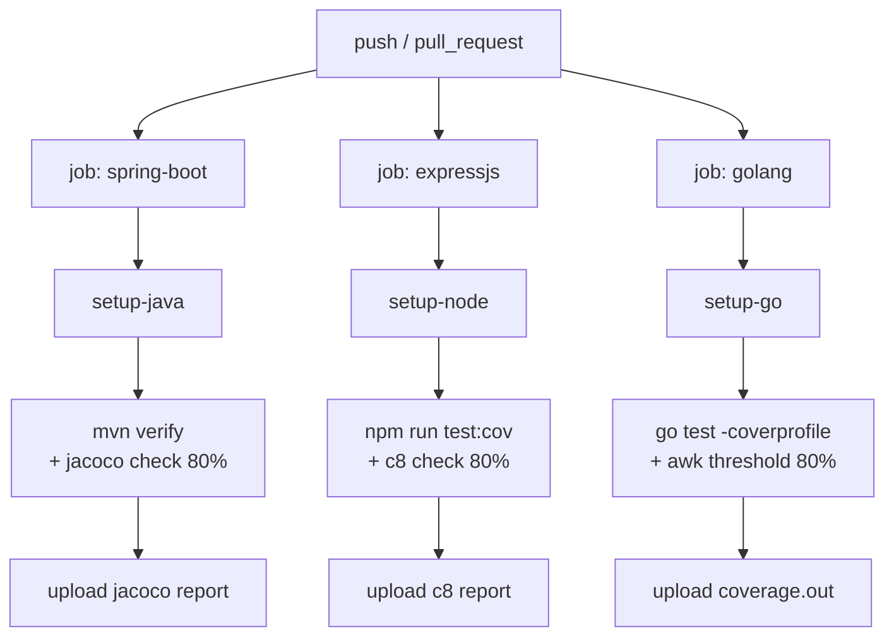

# 06 — CI/CD with 80% coverage gate

Goal: every push and every PR runs the full test suite, generates a coverage report, and **fails the build if line coverage drops below 80%**. Three independent pipelines, one per stack, all on GitHub Actions.

## Pipeline structure



Each job is independent — failure in one doesn't block the others. Coverage reports are uploaded as workflow artifacts and (optionally) to Codecov for trend tracking.

Testcontainers needs Docker available on the runner. GitHub's `ubuntu-latest` image has Docker pre-installed; no extra setup needed.

## Per-stack coverage tooling

| Stack | Tool | Threshold mechanism |
|-------|------|---------------------|
| Spring Boot | **JaCoCo** (`jacoco-maven-plugin`) | `<rule>` in plugin config |
| Express | **c8** wrapping `node:test`, or **Vitest --coverage** | `c8 check-coverage --lines 80` |
| Go | **`go test -coverprofile`** + small `awk` check | inline script |

### Spring Boot — JaCoCo

Add to `spring-boot/pom.xml`:

```xml
<plugin>
    <groupId>org.jacoco</groupId>
    <artifactId>jacoco-maven-plugin</artifactId>
    <executions>
        <execution>
            <goals><goal>prepare-agent</goal></goals>
        </execution>
        <execution>
            <id>jacoco-report</id>
            <phase>test</phase>
            <goals><goal>report</goal></goals>
        </execution>
        <execution>
            <id>jacoco-check</id>
            <phase>verify</phase>
            <goals><goal>check</goal></goals>
            <configuration>
                <rules>
                    <rule>
                        <element>BUNDLE</element>
                        <limits>
                            <limit>
                                <counter>LINE</counter>
                                <value>COVEREDRATIO</value>
                                <minimum>0.80</minimum>
                            </limit>
                        </limits>
                    </rule>
                </rules>
            </configuration>
        </execution>
    </executions>
</plugin>
```

`./mvnw verify` now runs tests, generates `target/site/jacoco/index.html`, and fails if line coverage is below 80%.

### Express — c8 with `node:test`

```bash
npm i -D c8
```

`package.json`:

```json
"scripts": {
    "test": "node --test test/**/*.test.js",
    "test:cov": "c8 --reporter=text --reporter=lcov --check-coverage --lines 80 --statements 80 --branches 70 npm test"
}
```

`c8 --check-coverage --lines 80` fails the process (exit code 1) if line coverage is below 80%. The CI step `npm run test:cov` propagates that exit code.

### Go — `go test -coverprofile`

```bash
go test -coverprofile=coverage.out ./...
go tool cover -func=coverage.out
```

The last line of `cover -func` output is `total: (statements) NN.N%`. A small awk/grep checks it:

```bash
coverage=$(go tool cover -func=coverage.out | awk '/^total:/ { print $3 }' | tr -d '%')
threshold=80
awk -v c=$coverage -v t=$threshold 'BEGIN { if (c < t) { exit 1 } }'
```

Or use a small Go program for clarity (`cmd/cover-check/main.go`). Either works.

## GitHub Actions workflows

Three workflow files, one per stack, in `.github/workflows/`. They run on every push and PR but only when files in their stack change (path filter) — keeps CI fast.

### `.github/workflows/spring-boot.yml`

```yaml
name: spring-boot

on:
  push:
    paths: ['spring-boot/**', 'db/**', '.github/workflows/spring-boot.yml']
  pull_request:
    paths: ['spring-boot/**', 'db/**', '.github/workflows/spring-boot.yml']

jobs:
  test:
    runs-on: ubuntu-latest
    defaults: { run: { working-directory: spring-boot } }
    steps:
      - uses: actions/checkout@v4
      - uses: actions/setup-java@v4
        with:
          java-version: 25
          distribution: temurin
          cache: maven
      - run: ./mvnw -B verify
      - if: always()
        uses: actions/upload-artifact@v4
        with:
          name: jacoco-report
          path: spring-boot/target/site/jacoco/
```

`./mvnw verify` runs tests AND the JaCoCo check. If coverage is below 80%, the step fails and the workflow fails.

### `.github/workflows/expressjs.yml`

```yaml
name: expressjs

on:
  push:
    paths: ['expressjs/**', 'db/**', '.github/workflows/expressjs.yml']
  pull_request:
    paths: ['expressjs/**', 'db/**', '.github/workflows/expressjs.yml']

jobs:
  test:
    runs-on: ubuntu-latest
    defaults: { run: { working-directory: expressjs } }
    steps:
      - uses: actions/checkout@v4
      - uses: actions/setup-node@v4
        with:
          node-version: '22'
          cache: npm
          cache-dependency-path: expressjs/package-lock.json
      - run: npm ci
      - run: npm run test:cov
      - if: always()
        uses: actions/upload-artifact@v4
        with:
          name: c8-report
          path: expressjs/coverage/
```

### `.github/workflows/golang.yml`

```yaml
name: golang

on:
  push:
    paths: ['golang/**', 'db/**', '.github/workflows/golang.yml']
  pull_request:
    paths: ['golang/**', 'db/**', '.github/workflows/golang.yml']

jobs:
  test:
    runs-on: ubuntu-latest
    defaults: { run: { working-directory: golang } }
    steps:
      - uses: actions/checkout@v4
      - uses: actions/setup-go@v5
        with:
          go-version: '1.26'
          cache-dependency-path: golang/go.sum
      - run: go test -coverprofile=coverage.out -v ./...
      - name: Check coverage threshold
        run: |
          coverage=$(go tool cover -func=coverage.out | awk '/^total:/ { print $3 }' | tr -d '%')
          echo "coverage: ${coverage}%"
          awk -v c=$coverage 'BEGIN { if (c < 80) { exit 1 } }'
      - if: always()
        uses: actions/upload-artifact@v4
        with:
          name: go-coverage
          path: golang/coverage.out
```

## Playwright workflow (optional, separate)

Run Playwright on a separate workflow because it needs a running app (slower, separate from per-stack coverage). Matrix-run against all three stacks.

```yaml
name: playwright

on:
  pull_request:

jobs:
  e2e:
    strategy:
      matrix:
        stack: [spring-boot, expressjs, golang]
    runs-on: ubuntu-latest
    services:
      postgres:
        image: postgres:18-alpine
        env:
          POSTGRES_DB: registration
          POSTGRES_USER: registration
          POSTGRES_PASSWORD: registration_dev_pw
        ports: ['5432:5432']
        options: --health-cmd pg_isready
    steps:
      - uses: actions/checkout@v4
      # Set up Java / Node / Go conditionally
      # Start the stack-under-test in background
      # Run Playwright
      - run: npx playwright test
```

The matrix runs three jobs in parallel — every stack gets exercised by the same Playwright spec. This catches "the stack drifted from the contract" issues.

## k6 — *not* in CI

Don't put perf tests in PR-blocking CI. The runner hardware varies; p95 latency on a GitHub-hosted runner is not the same as on production hardware. Run k6 manually or on a scheduled cron against dedicated hardware, and publish results separately.

## Why 80%, why "lines"

| Metric | What it counts | Pros | Cons |
|--------|----------------|------|------|
| Lines | source lines executed | easy to read; correlates with effort | doesn't catch unbranched conditionals |
| Statements | discrete statements | similar to lines | similar |
| Branches | true/false paths through `if/switch` | catches unhandled conditions | harder to hit 80% |
| Functions | functions called | weak signal | a "covered" function may still skip branches |

80% line coverage is the conventional minimum that:
- catches the "we forgot to test the new feature" case
- doesn't punish small utility files that don't need exhaustive testing
- can be hit without writing meaningless tests just to game the metric

Coverage isn't a quality measure — it's a *blind-spot detector*. 80% means "20% of lines are not exercised by any test"; investigate which ones.

## What students should leave with

By the end of this section a student should be able to:

1. Add JaCoCo / c8 / `go test -cover` to an existing project.
2. Wire it into a GitHub Actions workflow that fails on <80% coverage.
3. Read a coverage report and identify which classes/files/functions are uncovered.
4. Explain why Playwright runs in a separate workflow and k6 doesn't run in CI at all.
