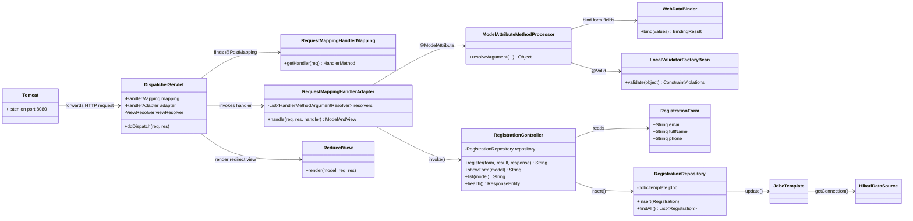
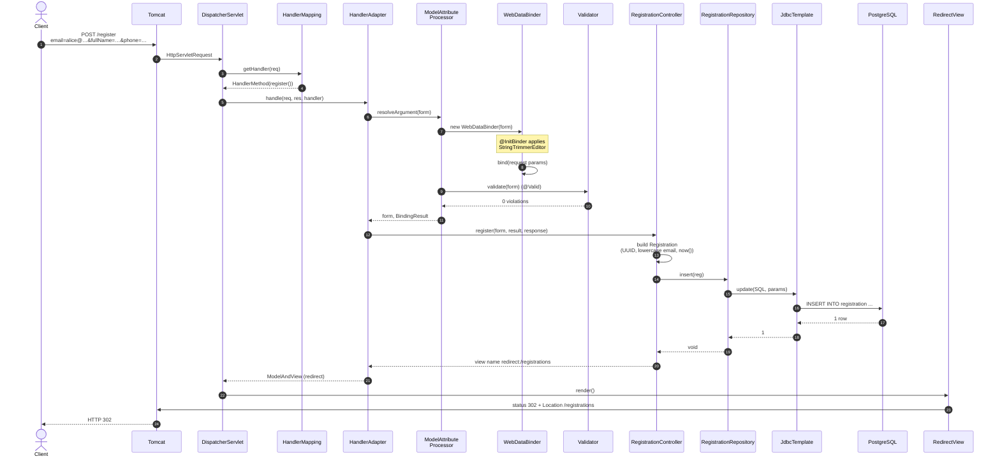

# 07 — Walkthrough: Spring Boot

What happens between `curl -X POST http://localhost:8080/register ...` and the `HTTP/1.1 302 Location: /registrations` response. We trace the **happy path** in detail (valid POST), then briefly cover the **validation-error** and **duplicate-email** branches.

## Class diagram — who collaborates with whom



Every layer above `RegistrationController` is Spring framework code; everything from the controller down is our code. That is the "under the hood" line for Spring Boot.

## Sequence diagram — POST /register (happy path)



That is **24 numbered steps** between the wire and the response. Most of the work happens before our controller method even gets called.

## Step-by-step trace

### Phase 1 — request enters the framework

1. **Tomcat** (the embedded servlet container started by `spring-boot-starter-webmvc`) accepts the TCP connection on port `${HTTP_PORT}` and parses the HTTP request.
2. Tomcat hands the `HttpServletRequest` / `HttpServletResponse` pair to `DispatcherServlet` — Spring's *front controller* (pattern #1 in [01-webapp-patterns.md](01-webapp-patterns.md)). This servlet is registered at `/*` by Spring Boot auto-config, so it sees every request.
3. `DispatcherServlet.doDispatch()` asks `RequestMappingHandlerMapping` "which method handles `POST /register`?" The mapping reads the `@RequestMapping` / `@PostMapping` annotations on every controller bean at startup and stores them in an internal lookup. Match found: `RegistrationController.register`.

### Phase 2 — argument resolution

The handler signature is:

```java
public String register(
    @Valid @ModelAttribute("form") RegistrationForm form,
    BindingResult result,
    HttpServletResponse response)
```

— [`RegistrationController.java:52-56`](../spring-boot/src/main/java/com/artivisi/techstack/registration/web/RegistrationController.java#L52-L56)

Spring's `RequestMappingHandlerAdapter` walks a list of `HandlerMethodArgumentResolver` instances to fill each parameter:

| Parameter | Resolver | What it does |
|-----------|----------|--------------|
| `RegistrationForm form` | `ModelAttributeMethodProcessor` | Instantiates the record from request parameters |
| `BindingResult result` | (same) | Auto-paired with the preceding `@ModelAttribute` |
| `HttpServletResponse response` | `ServletResponseMethodArgumentResolver` | Hands over the response object directly |

The `ModelAttributeMethodProcessor` does three things in order:

1. **Construct an empty `RegistrationForm`** using its canonical constructor.
2. **Bind request params** via `WebDataBinder` — which is where our `@InitBinder` ([`RegistrationController.java:34-37`](../spring-boot/src/main/java/com/artivisi/techstack/registration/web/RegistrationController.java#L34-L37)) registers `StringTrimmerEditor.class`. Effect: every `String` param is `.trim()`-ed before being assigned, and empty strings become `null`. So `"  alice@example.com  "` → `"alice@example.com"`, `""` → `null`.
3. **Run `@Valid`** by delegating to `LocalValidatorFactoryBean` (which under the hood uses Hibernate Validator). It evaluates each `@NotBlank` / `@Size` / `@Pattern` annotation declared on [`RegistrationForm.java`](../spring-boot/src/main/java/com/artivisi/techstack/registration/web/RegistrationForm.java). Violations are collected into a `BindingResult`.

If there are zero violations, control falls through to the handler body.

### Phase 3 — controller logic (our code)

[`RegistrationController.java:58-79`](../spring-boot/src/main/java/com/artivisi/techstack/registration/web/RegistrationController.java#L58-L79)

```java
if (result.hasErrors()) {                                 // line 58
    response.setStatus(HttpStatus.BAD_REQUEST.value());   // line 59
    return "form";                                        // line 60
}

Registration reg = new Registration(                      // line 63
        UUID.randomUUID(),                                // line 64  ← server-generated
        form.email().toLowerCase(),                       // line 65  ← normalize
        form.fullName(),                                  // line 66
        form.phone(),                                     // line 67
        OffsetDateTime.now()                              // line 68  ← server-generated
);

try {                                                     // line 71
    repository.insert(reg);                               // line 72
} catch (DuplicateKeyException e) {                       // line 73
    result.rejectValue("email", "duplicate",              // line 74
        "email is already registered");
    response.setStatus(HttpStatus.CONFLICT.value());      // line 75
    return "form";                                        // line 76
}

return "redirect:/registrations";                         // line 79
```

Line by line:

- **L58** — `result.hasErrors()` is `false` on the happy path; we skip to L63.
- **L63-L69** — Build the *domain* model from the *form* model. Note the form has `String email` (could be uppercase); the domain has the lowercased version. This is where the two models diverge.
- **L64** — UUID is generated server-side; the form doesn't carry it. Schema's CHECK constraints would refuse a non-UUID column anyway.
- **L68** — Timestamp is server-side too. The DB has no `DEFAULT NOW()` (deliberate, per the no-fallback policy in `db/schema.sql`).
- **L72** — Dispatch to the repository. If insert succeeds, returns void; if it throws `DuplicateKeyException`, we hit L73.
- **L79** — Return a "view name" that starts with `redirect:`. Spring sees this and produces a `RedirectView` instead of looking up a template.

### Phase 4 — repository → JDBC → PostgreSQL

[`RegistrationRepository.java:19-28`](../spring-boot/src/main/java/com/artivisi/techstack/registration/repository/RegistrationRepository.java#L19-L28)

```java
public void insert(Registration r) {
    jdbc.update(
            "INSERT INTO registration (id, email, full_name, phone, created_at) VALUES (?, ?, ?, ?, ?)",
            r.id(), r.email(), r.fullName(), r.phone(), r.createdAt()
    );
}
```

`JdbcTemplate.update(...)` does:

1. Borrow a connection from the `HikariDataSource` pool (created by Spring Boot from the `DataSource` bean our [`DataSourceConfig.java`](../spring-boot/src/main/java/com/artivisi/techstack/registration/config/DataSourceConfig.java) defined).
2. Create a `PreparedStatement` with the SQL.
3. Set each `?` from the varargs in order — Spring's `BeanPropertyParameterMappedSetter` maps `UUID` → JDBC UUID, `OffsetDateTime` → JDBC TIMESTAMPTZ. No manual type conversion needed.
4. Execute. Postgres applies the row + checks `UNIQUE(email)` and all the `CHECK` constraints from `V1__create_registration.sql`. If any fails, the JDBC driver throws `SQLException`; Spring's `SQLExceptionTranslator` converts SQL state `23505` to `DuplicateKeyException`.
5. Return the row count.
6. Release the connection back to the pool.

### Phase 5 — view resolution + response

Back in `DispatcherServlet`:

1. Handler returned `"redirect:/registrations"` (a `String`, wrapped into `ModelAndView`).
2. The configured `ViewResolver` chain inspects the string. The standard `ViewNameTranslator` recognizes the `redirect:` prefix and returns a `RedirectView`.
3. `RedirectView.render()`:
   - Writes `Location: /registrations` to the response headers.
   - Writes status `302 Found` (configurable; default is 302 for `redirect:` prefix).
   - Does **not** write a body.
4. Tomcat serializes the response to the wire.

The client sees HTTP 302 with `Location: /registrations` and (most clients) follows it, triggering `GET /registrations` which renders the list page — completing the **Post-Redirect-Get** pattern.

## Validation-error branch

For `POST /register email=invalid&fullName=&phone=12345`:

- Phase 2 step 3 (`@Valid`) finds three violations: email regex, name `@NotBlank`, phone length.
- `BindingResult` is populated with `FieldError` instances.
- `result.hasErrors()` is `true` at [`RegistrationController.java:58`](../spring-boot/src/main/java/com/artivisi/techstack/registration/web/RegistrationController.java#L58).
- We `setStatus(400)` and return the `"form"` view name.
- `ViewResolver` resolves `"form"` → `templates/form.html` (Thymeleaf).
- Thymeleaf's `#fields.hasErrors('email')` is true, so each field's red error paragraph renders.
- The values from the submitted `RegistrationForm` (trimmed but not lowercased, since the lowercase happens at L65 — *after* validation) flow back into the inputs.

Status: **400**. Body: re-rendered form with inline errors. Browser does not change URL.

## Duplicate-email branch

For `POST /register` with an email that already exists in `registration`:

- Phases 1-3 succeed.
- Phase 4 step 4 — Postgres rejects with SQL state `23505`.
- JDBC driver throws → Spring's `SQLExceptionTranslator` → `DuplicateKeyException`.
- [`RegistrationController.java:73-76`](../spring-boot/src/main/java/com/artivisi/techstack/registration/web/RegistrationController.java#L73-L76) catches, adds a field error on `email`, sets status 409, returns view name `"form"`.
- Same view-rendering path as the validation-error branch, but with a single error and status 409.

## What "under the hood" means for Spring Boot

The four pieces of framework code between Tomcat and our controller — `DispatcherServlet`, `HandlerMapping`, `HandlerAdapter`, `ModelAttributeMethodProcessor` — are exactly the **Front Controller + MVC + Interceptor** combination from [01-webapp-patterns.md](01-webapp-patterns.md), implemented in heavyweight, configurable, annotation-driven Java. Spring's value proposition is that these layers exist *and* are pluggable: you can register your own `HandlerMethodArgumentResolver`, your own `HandlerInterceptor`, your own `ViewResolver`. The trade-off vs Express/Go is many more layers to understand, in exchange for vastly more knobs to turn without forking the framework.
