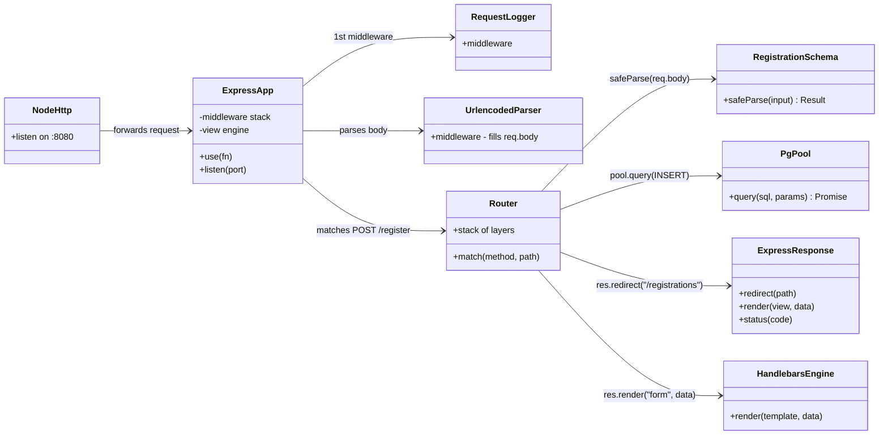
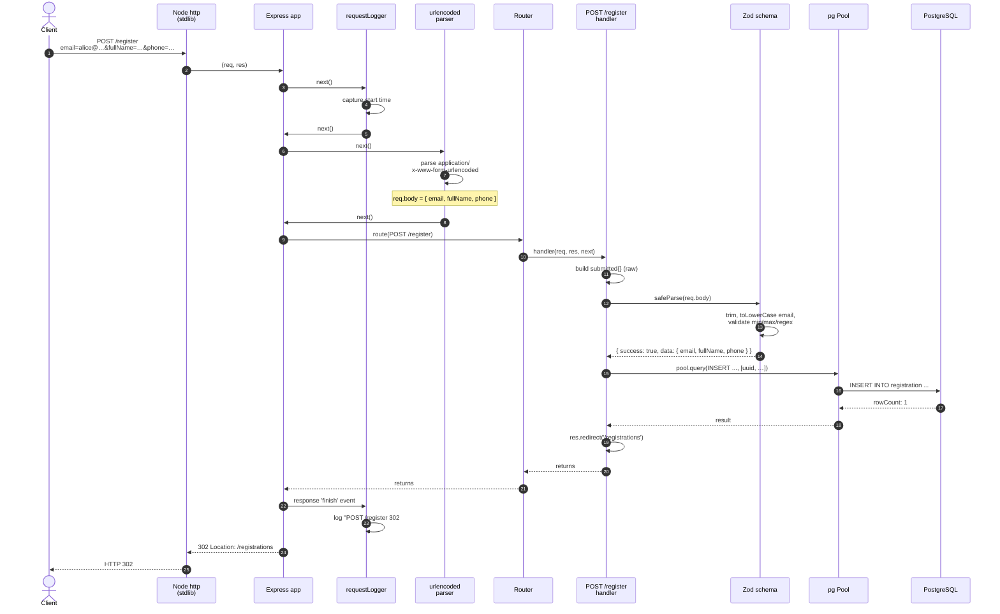

# 08 — Walkthrough: Express

What happens between `curl -X POST http://localhost:8080/register ...` and the `HTTP/1.1 302 Location: /registrations` response on the Express stack. Same happy-path / error-path structure as the Spring Boot walkthrough.

## Class diagram — who collaborates with whom



Compared to Spring Boot's diagram, Express is *much* flatter. There is no front-controller dispatch indirection, no annotation scanning, no separate handler-mapping/handler-adapter. The router is a sequence of `(method, path, handler)` tuples; matching is a linear walk.

## Sequence diagram — POST /register (happy path)



Notice the middleware chain (`requestLogger` → `urlencoded` → `router`) is a **strict linear pipeline**. Each step calls `next()` to advance; if any step doesn't call `next()`, the chain stops. The `requestLogger` is interesting — it doesn't block, but it *also* attaches a listener (`res.on('finish', …)`) that runs after the response is written. That's how you measure end-to-end time even though logging happens "first."

## Step-by-step trace

### Phase 1 — request enters the framework

1. **Node's stdlib `http` server** accepts the connection on `${HTTP_PORT}` and parses the HTTP request. This is the actual server — Express is *not* a server; it's an `http.RequestListener` that you hand to `http.createServer()` (which `app.listen()` does internally).
2. Node invokes the Express app's listener with `(req, res)`.
3. The app walks its middleware stack from top to bottom. Configured in [`src/app.js`](../expressjs/src/app.js).

### Phase 2 — middleware chain

[`src/app.js:41-45`](../expressjs/src/app.js#L41-L45)

```javascript
app.use(requestLogger);                                                  // line 41
app.use(express.urlencoded({ extended: false }));                        // line 42
app.use(express.static(path.join(__dirname, '..', 'public')));           // line 43
app.use('/', registrationRoutes);                                        // line 45
```

Each `app.use(fn)` registers a *layer*. For each incoming request, Express walks layers in order, calling each one with `(req, res, next)`. A layer can:
- short-circuit by writing a response and not calling `next()`,
- pass through by calling `next()`,
- transform `req`/`res` and then call `next()`.

For our `POST /register`:

| Step | Middleware | What it does |
|------|------------|--------------|
| 2.1 | `requestLogger` ([app.js:15-23](../expressjs/src/app.js#L15-L23)) | Records `Date.now()`, attaches `res.on('finish')` listener, calls `next()`. |
| 2.2 | `express.urlencoded` | Reads the request body, parses `application/x-www-form-urlencoded`, sets `req.body = { email, fullName, phone }`. Calls `next()`. |
| 2.3 | `express.static` | Tries to match a file in `public/`. The path `/register` doesn't exist there, so this middleware doesn't write a response — calls `next()`. |
| 2.4 | `registrationRoutes` (the `Router`) | Matches `POST /register` → our handler. |

### Phase 3 — router match + handler

[`src/routes/registration.js:26-59`](../expressjs/src/routes/registration.js#L26-L59)

```javascript
router.post('/register', async (req, res, next) => {                     // line 26
  const submitted = {                                                    // line 27
    email: req.body.email ?? '',                                         // line 28
    fullName: req.body.fullName ?? '',                                   // line 29
    phone: req.body.phone ?? '',                                         // line 30
  };

  const result = RegistrationSchema.safeParse(req.body);                 // line 33

  if (!result.success) {                                                 // line 35
    return res.status(400).render('form', {                              // line 36
      values: submitted,                                                 // line 37
      errors: collectFieldErrors(result.error),                          // line 38
    });
  }

  const { email, fullName, phone } = result.data;                        // line 42

  try {
    await pool.query(                                                    // line 45
      'INSERT INTO registration (id, email, full_name, phone, created_at) VALUES ($1, $2, $3, $4, $5)',
      [randomUUID(), email, fullName, phone, new Date()],                // line 47
    );
    res.redirect('/registrations');                                      // line 49
  } catch (err) {
    if (err.code === '23505') {                                          // line 51
      return res.status(409).render('form', { ... });                    // line 52
    }
    next(err);                                                           // line 57
  }
});
```

Line by line for the happy path:

- **L27-L31** — Snapshot the raw submitted values *before* Zod transforms them. Used to re-render the form unchanged on validation failure (so the user sees what they typed).
- **L33** — `safeParse` is Zod's non-throwing API. Returns `{ success: true, data }` or `{ success: false, error }`. Internally:
  - applies `.trim()` and `.toLowerCase()` transforms,
  - runs each rule (`min`, `max`, `regex`),
  - collects all issues into a `ZodError`.
- **L35** — Validation passed; skip to L42.
- **L42** — Destructure the *normalized* values from `result.data` — these are trimmed and (for email) lowercased.
- **L45-L48** — Issue the INSERT via the `pg` connection pool. Parameters are bound positionally (`$1`, `$2`, …). `pg` handles UUID-as-string and `Date` → TIMESTAMPTZ conversion automatically.
- **L49** — `res.redirect('/registrations')` writes `Status: 302 Found` and `Location: /registrations` to the response. Express sends the response immediately; no return value is needed.

### Phase 4 — pg → PostgreSQL

`pool.query(...)`:

1. Acquires an idle connection from the pool (created at module load in [`src/db.js`](../expressjs/src/db.js)).
2. Sends the parameterized SQL via the PostgreSQL wire protocol.
3. Receives the row count.
4. Releases the connection.

If the row would violate `UNIQUE(email)`, Postgres returns SQL state `23505`; `pg` surfaces this as `err.code === '23505'` (a plain string). That's what L51 checks.

### Phase 5 — response back to client

1. `res.redirect()` calls `res.writeHead(302, { Location: '/registrations' })`, then `res.end()`.
2. The `'finish'` event fires on `res`. Our `requestLogger` listener runs:
   ```
   [2026-05-14T07:13:48.530Z] POST /register 302 14ms
   ```
3. Node's http server flushes the response to the socket; the client receives `HTTP/1.1 302 Found`.

The browser follows the redirect, issuing `GET /registrations`. That hits [`src/routes/registration.js:61-70`](../expressjs/src/routes/registration.js#L61-L70), which SELECTs the rows and renders `list.hbs`. Post-Redirect-Get complete.

## Validation-error branch

For `POST /register email=invalid&fullName=&phone=12345`:

- Same path through phases 1-2.
- At L33, `safeParse` returns `{ success: false, error }` with three `ZodIssue` entries.
- L35 is true; we take the early return.
- `collectFieldErrors(result.error)` (from [`src/validation.js`](../expressjs/src/validation.js)) walks the issues and builds `{ email: '...', fullName: '...', phone: '...' }` — first message per field wins.
- `res.status(400).render('form', { values: submitted, errors })` runs the Handlebars engine over `views/form.hbs` with the model. The template's `{{#if errors.email}}` blocks light up.

Status: **400**, body: re-rendered form with inline errors.

Notice `values: submitted` — the *raw* (untrimmed, original case) values. The Spring Boot stack shows trimmed values because of its `StringTrimmerEditor` ordering; Express here preserves exactly what the user typed. This is a design choice each stack makes — the verify-script contract only cares about status codes.

## Duplicate-email branch

For an email that already exists:

- Phases 1-3 succeed up through L45.
- The INSERT fails; `pg` rejects the promise with an error whose `.code === '23505'`.
- L51 checks; L52 returns 409 with a single email-field error.

## What "under the hood" means for Express

Express is **a route table plus a middleware list, walked top-to-bottom on every request**. There is no separate dispatcher, no annotation scanner, no view-resolver chain. The application's HTTP behavior is fully readable by reading `app.js` plus the `router.post(...)` calls in order.

The flip side: cross-cutting concerns (logging, auth, error handling) are expressed as ordering rules in `app.use(...)`, which means *order matters*. Forgetting to register an error-handling middleware as the **last** layer means thrown errors crash the process instead of producing a clean 500. Spring's AOP-style declaration order doesn't matter; Express's does.
