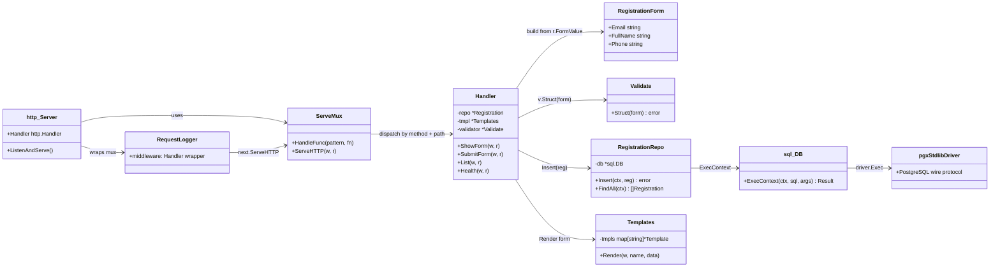
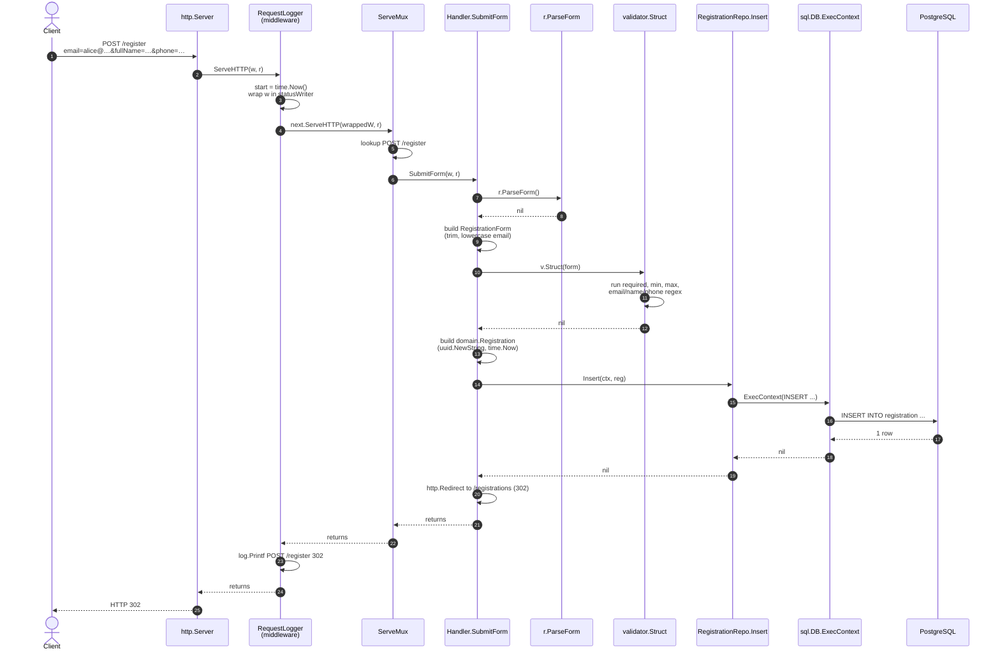

# 09 — Walkthrough: Go

What happens between `curl -X POST http://localhost:8080/register ...` and the `HTTP/1.1 302 Location: /registrations` response on the Go stack.

## Class diagram — who collaborates with whom

Go doesn't have classes, but we can show types + their method receivers + the wiring relationships. Same shape as the previous two walkthroughs.



Even flatter than Express. Go's stdlib `net/http` *is* the framework — there's no separate dispatcher object. `ServeMux` does the matching; everything else is your own struct methods.

## Sequence diagram — POST /register (happy path)



Same pattern as Express's chain (middleware → mux → handler → repo → DB → response) but expressed in Go idioms: middleware is a *function that wraps `http.Handler`*, the mux is the stdlib's, and there's no third-party HTTP framework.

## Step-by-step trace

### Phase 1 — request enters the framework

1. **`http.Server`** ([`cmd/server/main.go:37-48`](../golang/cmd/server/main.go#L37-L48)) accepts the TCP connection on `:${HTTP_PORT}` and parses the HTTP request.
2. The server's `Handler` field is set to the result of `web.RequestLogger(mux)` ([main.go:39](../golang/cmd/server/main.go#L39)) — the mux wrapped in our logger middleware. The server calls `Handler.ServeHTTP(w, r)`.

### Phase 2 — middleware wrapping

[`internal/web/middleware.go:9-15`](../golang/internal/web/middleware.go#L9-L15)

```go
func RequestLogger(next http.Handler) http.Handler {
    return http.HandlerFunc(func(w http.ResponseWriter, r *http.Request) {
        start := time.Now()
        wrapped := &statusWriter{ResponseWriter: w, status: http.StatusOK}
        next.ServeHTTP(wrapped, r)
        log.Printf("%s %s %d %s", r.Method, r.URL.Path, wrapped.status, time.Since(start))
    })
}
```

Go middleware is just a function that takes a `Handler` and returns a `Handler`. The pattern:

- **Before**: do whatever needs to happen before the inner handler (here: capture start time, wrap the response writer).
- Call `next.ServeHTTP(...)` to invoke the inner handler.
- **After**: do whatever needs to happen after (here: log the result).

The `statusWriter` wrapper intercepts the call to `WriteHeader(code)` so we can record the status code before the inner handler is done. Without this wrapper, we'd have no clean way to learn what status was written.

### Phase 3 — mux dispatch

[`cmd/server/main.go:30-33`](../golang/cmd/server/main.go#L30-L33)

```go
mux := http.NewServeMux()
handler.Register(mux)
mux.Handle("GET /css/", http.FileServer(http.Dir("static")))
```

`handler.Register(mux)` ([`internal/web/handler.go:28-33`](../golang/internal/web/handler.go#L28-L33)):

```go
func (h *Handler) Register(mux *http.ServeMux) {
    mux.HandleFunc("GET /", h.ShowForm)
    mux.HandleFunc("POST /register", h.SubmitForm)
    mux.HandleFunc("GET /registrations", h.List)
    mux.HandleFunc("GET /health", h.Health)
}
```

Since Go 1.22, `ServeMux` supports method + path patterns. `POST /register` matches only POST requests to `/register`. The mux's lookup is essentially a `map[methodPath]handler` — O(1) dispatch.

For our `POST /register` → dispatch to `Handler.SubmitForm(w, r)`.

### Phase 4 — handler logic

[`internal/web/handler.go:54-104`](../golang/internal/web/handler.go#L54-L104)

```go
func (h *Handler) SubmitForm(w http.ResponseWriter, r *http.Request) {
    if err := r.ParseForm(); err != nil {                              // line 55
        http.Error(w, "bad form data", http.StatusBadRequest)
        return
    }

    submitted := map[string]string{                                    // line 60
        "email":    r.FormValue("email"),
        "fullName": r.FormValue("fullName"),
        "phone":    r.FormValue("phone"),
    }

    form := RegistrationForm{                                          // line 66
        Email:    strings.ToLower(strings.TrimSpace(r.FormValue("email"))),
        FullName: strings.TrimSpace(r.FormValue("fullName")),
        Phone:    strings.TrimSpace(r.FormValue("phone")),
    }

    if err := h.validator.Struct(form); err != nil {                   // line 72
        w.WriteHeader(http.StatusBadRequest)
        _ = h.tmpl.Render(w, "form", formPage{
            Values: submitted,
            Errors: CollectErrors(err),
        })
        return
    }

    reg := domain.Registration{                                        // line 81
        ID:        uuid.NewString(),
        Email:     form.Email,
        FullName:  form.FullName,
        Phone:     form.Phone,
        CreatedAt: time.Now().UTC(),
    }

    if err := h.repo.Insert(r.Context(), reg); err != nil {            // line 89
        if errors.Is(err, repository.ErrDuplicateEmail) {              // line 90
            w.WriteHeader(http.StatusConflict)
            _ = h.tmpl.Render(w, "form", formPage{ ... })
            return
        }
        log.Printf("insert error: %v", err)
        http.Error(w, "server error", http.StatusInternalServerError)
        return
    }

    http.Redirect(w, r, "/registrations", http.StatusFound)            // line 103
}
```

Line by line for the happy path:

- **L55** — `r.ParseForm()` reads the request body, parses `application/x-www-form-urlencoded`, populates `r.Form` and `r.PostForm`. Returns an error if the body is malformed.
- **L60-L64** — Snapshot the *raw* submitted values (mirrors the Express approach — re-render shows what the user typed).
- **L66-L70** — Build the validation form. Each field is `strings.TrimSpace`-d; email is also `strings.ToLower`-cased (so the regex and the DB CHECK `email = lower(email)` both pass).
- **L72** — `validator.Struct(form)` runs the `validate:"..."` tags. Returns `nil` (no error) on success. Configured at [`internal/web/form.go`](../golang/internal/web/form.go).
- **L81-L87** — Build the domain object with server-generated UUID and timestamp. Same separation as Spring Boot's form-vs-domain split.
- **L89** — Call the repository. `r.Context()` propagates request cancellation into the SQL call (if the client disconnects, the DB call can be cancelled).
- **L103** — `http.Redirect` writes `Status: 302 Found` and `Location: /registrations`. Standard library — there is no framework method for this.

### Phase 5 — repository → pgx → PostgreSQL

[`internal/repository/registration.go:23-39`](../golang/internal/repository/registration.go#L23-L39)

```go
func (r *Registration) Insert(ctx context.Context, reg domain.Registration) error {
    _, err := r.db.ExecContext(ctx,
        `INSERT INTO registration (id, email, full_name, phone, created_at) VALUES ($1, $2, $3, $4, $5)`,
        reg.ID, reg.Email, reg.FullName, reg.Phone, reg.CreatedAt,
    )
    if err != nil {
        var pgErr *pgconn.PgError
        if errors.As(err, &pgErr) && pgErr.Code == "23505" {
            return ErrDuplicateEmail
        }
        return err
    }
    return nil
}
```

What happens inside `r.db.ExecContext`:

1. `database/sql` picks an idle connection from its pool (the pool is built by `sql.Open("pgx", url)` in [`internal/config/db.go`](../golang/internal/config/db.go)).
2. The pgx stdlib driver translates the call into the PostgreSQL wire protocol.
3. Postgres runs the INSERT, checking the UNIQUE constraint and all the `CHECK` clauses from `V1__create_registration.sql`.
4. The driver returns a `sql.Result`. We ignore the row count (`_`) and only check the error.
5. If Postgres rejected with SQL state `23505`, the driver wraps it in a `*pgconn.PgError`. We `errors.As` it and convert to our domain-level `ErrDuplicateEmail` sentinel so the handler can branch without importing pgx.

This is the cleanest pattern Go offers: **type-asserted error inspection at the boundary, domain-level errors flowing up**. Spring's `SQLExceptionTranslator` does the same job behind annotations; Go does it explicitly.

### Phase 6 — response back to client

1. `http.Redirect(w, r, "/registrations", 302)`:
   - Sets `Location: /registrations`.
   - Calls `w.WriteHeader(302)` (intercepted by our `statusWriter`).
   - Writes a tiny HTML body with a `<a href="/registrations">` for browsers that don't follow redirects automatically.
2. `SubmitForm` returns; mux returns; control comes back to the `RequestLogger`.
3. The logger runs its "after" code: `log.Printf("POST /register 302 ##ms")`.
4. The http.Server flushes the response to the wire.

The client follows the 302 to `GET /registrations` ([`Handler.List`](../golang/internal/web/handler.go#L106)), which calls `repo.FindAll(ctx)` and renders `list.html`.

## Validation-error branch

For `POST /register email=invalid&fullName=&phone=12345`:

- L72's `validator.Struct(form)` returns a non-nil `validator.ValidationErrors` slice.
- `CollectErrors(err)` (in [`form.go`](../golang/internal/web/form.go)) walks the slice and builds the `{ email: "...", fullName: "...", phone: "..." }` map. The custom `RegisterTagNameFunc` makes `e.Field()` return `"fullName"` (from the struct tag) instead of `"FullName"` (the Go field name) — that's why the template's `{{.Errors.fullName}}` lookup works.
- `w.WriteHeader(http.StatusBadRequest)` followed by template render.

Status: **400**, body: re-rendered form.

## Duplicate-email branch

- Phase 5 step 5 wraps the pgconn error and returns `ErrDuplicateEmail`.
- Back in `SubmitForm` L90, `errors.Is(err, repository.ErrDuplicateEmail)` is true.
- We set status 409 and render the form with a single email-field error.

## What "under the hood" means for Go

Go's `net/http` package is *barely* a framework. It's:

1. An HTTP server that calls a `Handler` interface — anything with `ServeHTTP(w, r)`.
2. A `ServeMux` that dispatches by method + path.
3. Functions like `http.Redirect`, `http.Error`, `http.FileServer` that wrap common response patterns.

That's it. Everything else — middleware, validation, templating, DB pooling — is composition of stdlib primitives + small libraries we pull in deliberately.

The Go culture preference is to keep the indirection visible. There is no `@Controller` annotation hiding HTTP plumbing; the handler signature is exactly what gets called. Tracing a request is reading top-to-bottom: `main.go` wires routes → `handler.go` matches → `repository.go` runs SQL → response. No reflection, no proxies.

Compared to Spring Boot's 24-step trace at the top of [07-walkthrough-spring-boot.md](07-walkthrough-spring-boot.md), Go's trace is closer to **8 steps** — and every step is in code you, the developer, can `Cmd+Click` into.
